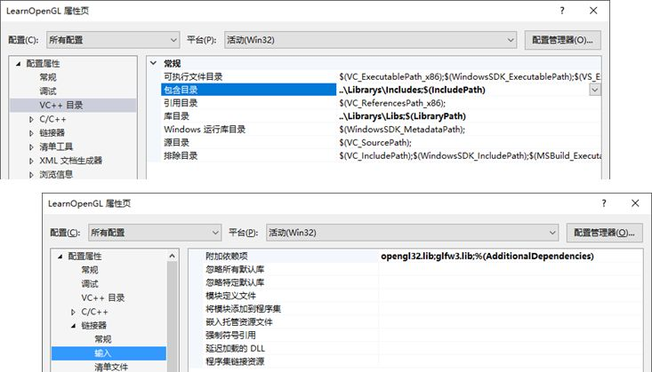
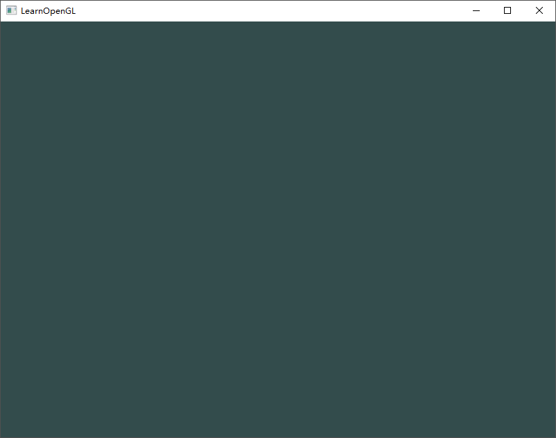
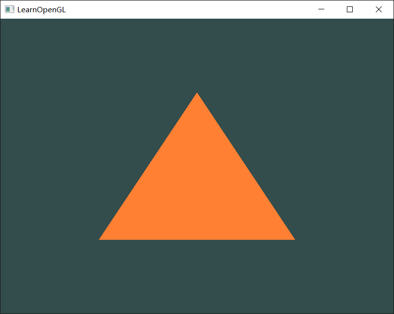
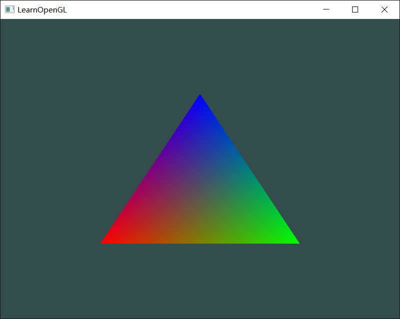
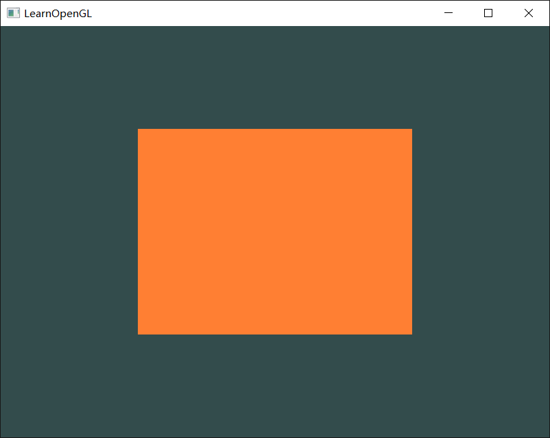
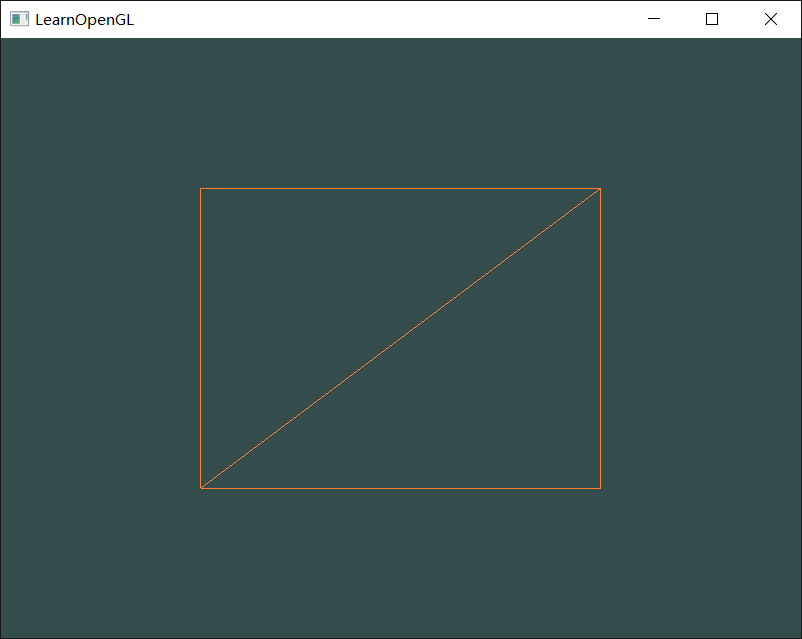
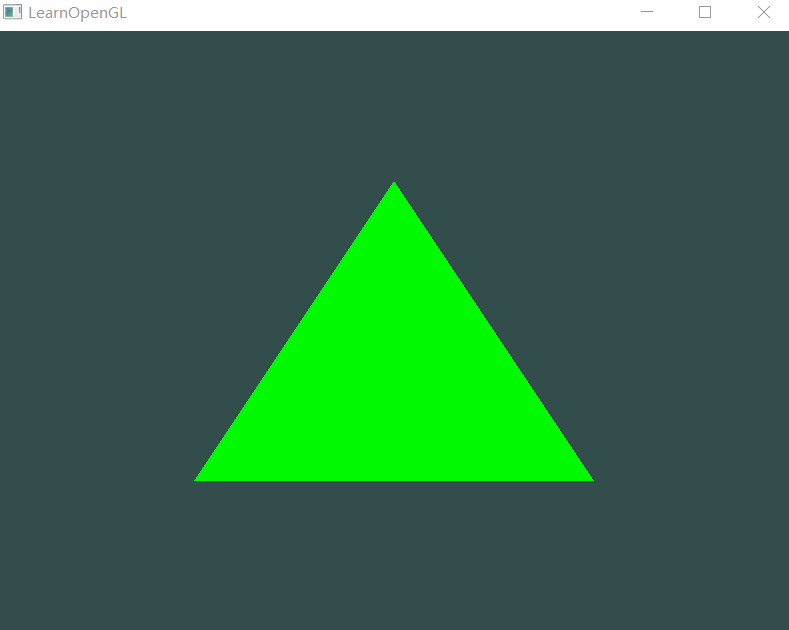
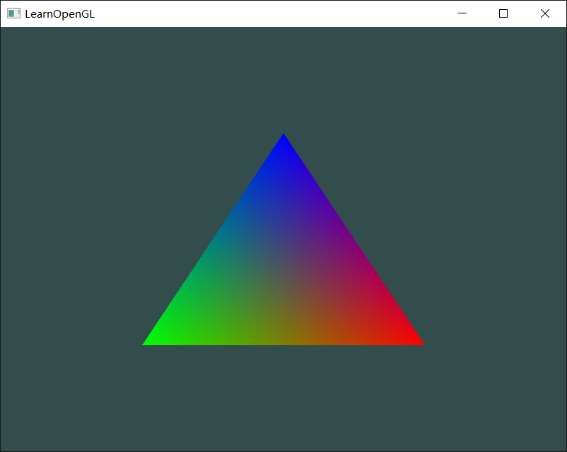

# LearnOpenGL

> 想继续深入学习计算机图形学。之前有些OpenGL编程的经验，不想就此给扔了（毕竟重头开始学习DirectX也需要花些时间，倒不如先把原理弄清，在战略转移）因此，再次重拾这个系列教程，发现教程又更新了不少内容，因此更加适合温故而知新了。所以，开始吧。
>
> Date: 2018.4.19
>
> Reference Website: https://learnopengl-cn.github.io/

## Day 01 你好，窗口

> Date: 2018.4.19

Getting started::OpenGL

Getting started::Creating a window

Getting started::Hello Window

### 1. 配置库

| 库名                                      | 作用                                           |
| ----------------------------------------- | ---------------------------------------------- |
| [GLFW](http://www.glfw.org/download.html) | 创建OpenGL上下文，定义窗口函数以及处理用户输入 |
| [GLAD](http://glad.dav1d.de/)             | 在运行时获取OpenGL函数地址                     |

我们要做的是，将头文件目录（Library\Includes）添加到工程的包含目录中，将库文件目录（Library\Libs）添加到工程的库目录中，在链接器中添加附加依赖项**opengl32.lib**，**glfw3.lib**，并且将glad.c添加到工程中。如下图。




### 2. 输出了一个窗口！并且可以通过Esc按键关闭窗口！



## Day 02 你好，三角形

> Date: 2018.8.31

### 1. VBO,VAO,EBO


### 2. Hello Triangle









## Day 03 着色器

> 2018.9.1

### GLSL

```c
#version version_number
in type in_variable_name;
in type in_variable_name;

out type out_variable_name;

uniform type uniform_name;

int main()
{
  // 处理输入并进行一些图形操作
  ...
  // 输出处理过的结果到输出变量
  out_variable_name = weird_stuff_we_processed;
}
```

### Uniform

更新uniform值的方法，注：更新一个uniform之前你**必须**先使用程序（调用glUseProgram)，因为它是在当前激活的着色器程序中设置uniform的。 

```c
float timeValue = glfwGetTime();
float greenValue = (sin(timeValue) / 2.0f) + 0.5f;
int vertexColorLocation = glGetUniformLocation(shaderProgram, "ourColor");
glUseProgram(shaderProgram);
glUniform4f(vertexColorLocation, 0.0f, greenValue, 0.0f, 1.0f);
```



### 更多属性

```c
float vertices[] = {
    // 位置              // 颜色
     0.5f, -0.5f, 0.0f,  1.0f, 0.0f, 0.0f,   // 右下
    -0.5f, -0.5f, 0.0f,  0.0f, 1.0f, 0.0f,   // 左下
     0.0f,  0.5f, 0.0f,  0.0f, 0.0f, 1.0f    // 顶部
};
```

因为我们添加了另一个顶点属性，并且更新了VBO的内存，我们就必须重新配置顶点属性指针。更新后的VBO内存中的数据现在看起来像这样： 


知道了现在使用的布局，我们就可以使用glVertexAttribPointer函数更新顶点格式， 

```c
// 位置属性
glVertexAttribPointer(0, 3, GL_FLOAT, GL_FALSE, 6 * sizeof(float), (void*)0);
glEnableVertexAttribArray(0);
// 颜色属性
glVertexAttribPointer(1, 3, GL_FLOAT, GL_FALSE, 6 * sizeof(float), (void*)(3* sizeof(float)));
glEnableVertexAttribArray(1);
```



## 自己的着色器类

