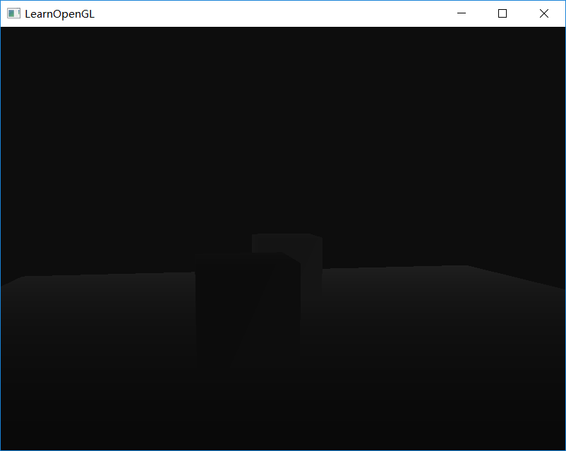

# LearnOpenGL

> 想继续深入学习计算机图形学。之前有些OpenGL编程的经验，不想就此给扔了（毕竟重头开始学习DirectX也需要花些时间，倒不如先把原理弄清，在战略转移）因此，再次重拾这个系列教程，发现教程又更新了不少内容，因此更加适合温故而知新了。所以，开始吧。
>
> Date: 2018.4.19
>
> Reference Website: https://learnopengl-cn.github.io/

## ----------Getting Started----------

## Day 01 你好，窗口

> 2018.4.19

Getting started::OpenGL

Getting started::Creating a window

Getting started::Hello Window

### 1. 配置库

| 库名                                      | 作用                                           |
| ----------------------------------------- | ---------------------------------------------- |
| [GLFW](http://www.glfw.org/download.html) | 创建OpenGL上下文，定义窗口函数以及处理用户输入 |
| [GLAD](http://glad.dav1d.de/)             | 在运行时获取OpenGL函数地址                     |

我们要做的是，将头文件目录（Library\Includes）添加到工程的包含目录中，将库文件目录（Library\Libs）添加到工程的库目录中，在链接器中添加附加依赖项**opengl32.lib**，**glfw3.lib**，并且将glad.c添加到工程中。如下图。


### 2. 输出了一个窗口！并且可以通过Esc按键关闭窗口！


## Day 02 你好，三角形

> 2018.8.31

### 1. VBO,VAO,EBO


### 2. Hello Triangle


## Day 03 着色器

> 2018.9.1

### GLSL

```c
#version version_number
in type in_variable_name;
in type in_variable_name;

out type out_variable_name;

uniform type uniform_name;

int main()
{
  // 处理输入并进行一些图形操作
  ...
  // 输出处理过的结果到输出变量
  out_variable_name = weird_stuff_we_processed;
}
```

### Uniform

更新uniform值的方法，注：更新一个uniform之前你**必须**先使用程序（调用glUseProgram)，因为它是在当前激活的着色器程序中设置uniform的。 

```c
float timeValue = glfwGetTime();
float greenValue = (sin(timeValue) / 2.0f) + 0.5f;
int vertexColorLocation = glGetUniformLocation(shaderProgram, "ourColor");
glUseProgram(shaderProgram);
glUniform4f(vertexColorLocation, 0.0f, greenValue, 0.0f, 1.0f);
```


### 更多属性

```c
float vertices[] = {
    // 位置              // 颜色
     0.5f, -0.5f, 0.0f,  1.0f, 0.0f, 0.0f,   // 右下
    -0.5f, -0.5f, 0.0f,  0.0f, 1.0f, 0.0f,   // 左下
     0.0f,  0.5f, 0.0f,  0.0f, 0.0f, 1.0f    // 顶部
};
```

因为我们添加了另一个顶点属性，并且更新了VBO的内存，我们就必须重新配置顶点属性指针。更新后的VBO内存中的数据现在看起来像这样： 


知道了现在使用的布局，我们就可以使用glVertexAttribPointer函数更新顶点格式， 

```c
// 位置属性
glVertexAttribPointer(0, 3, GL_FLOAT, GL_FALSE, 6 * sizeof(float), (void*)0);
glEnableVertexAttribArray(0);
// 颜色属性
glVertexAttribPointer(1, 3, GL_FLOAT, GL_FALSE, 6 * sizeof(float), (void*)(3* sizeof(float)));
glEnableVertexAttribArray(1);
```


### 自己的着色器类

练习


## Day 04 纹理

> 2018.9.1

- 纹理环绕方式

```c
glTexParameteri(GL_TEXTURE_2D, GL_TEXTURE_WRAP_S, GL_MIRRORED_REPEAT);
glTexParameteri(GL_TEXTURE_2D, GL_TEXTURE_WRAP_T, GL_MIRRORED_REPEAT);
```

- 纹理过滤

```c
glTexParameteri(GL_TEXTURE_2D, GL_TEXTURE_MIN_FILTER, GL_NEAREST);
glTexParameteri(GL_TEXTURE_2D, GL_TEXTURE_MAG_FILTER, GL_LINEAR);
```

- 多级渐远纹理（Mipmap）

```c
glTexParameteri(GL_TEXTURE_2D, GL_TEXTURE_MIN_FILTER, GL_LINEAR_MIPMAP_LINEAR);
glTexParameteri(GL_TEXTURE_2D, GL_TEXTURE_MAG_FILTER, GL_LINEAR);
```

- 加载与创建纹理

使用 [stb_image.h](https://github.com/nothings/stb)

- 应用纹理

- 纹理单元

注：一个纹理的默认纹理单元是0，它是默认的激活纹理单元，所以教程前面部分我们没有分配一个位置值。 

```c
glActiveTexture(GL_TEXTURE0); // 在绑定纹理之前先激活纹理单元
glBindTexture(GL_TEXTURE_2D, texture);
```

- 多个纹理单元的情况：

编辑片段着色器来接收另一个采样器 

```c
#version 330 core
...

uniform sampler2D texture1;
uniform sampler2D texture2;

void main()
{
    FragColor = mix(texture(texture1, TexCoord), texture(texture2, TexCoord), 0.2);
}
```

为了使用第二个纹理（以及第一个），我们必须改变一点渲染流程，先绑定两个纹理到对应的纹理单元，然后定义哪个uniform采样器对应哪个纹理单元： 

```c
glActiveTexture(GL_TEXTURE0);
glBindTexture(GL_TEXTURE_2D, texture1);
glActiveTexture(GL_TEXTURE1);
glBindTexture(GL_TEXTURE_2D, texture2);

glBindVertexArray(VAO);
glDrawElements(GL_TRIANGLES, 6, GL_UNSIGNED_INT, 0);
```

使用glUniform1i设置每个采样器的方式告诉OpenGL每个着色器采样器属于哪个纹理单元。我们只需要设置一次即可，所以这个会放在渲染循环的前面 

```c
ourShader.use(); // 别忘记在设置 uniform 之前激活 shader
glUniform1i(glGetUniformLocation(ourShader.ID, "texture1"), 0); // 手动设置
ourShader.setInt("texture2", 1); // 或者使用着色器类设置

while(...) 
{
    [...]
}
```

```c
stbi_set_flip_vertically_on_load(true); // stb_image.h能够在图像加载时帮助我们翻转y轴
```


## Day 05 变换

> 2018.9.3

[GLM 库](https://github.com/g-truc/glm)

GLM库从0.9.9版本起，默认会将矩阵类型初始化为一个零矩阵（所有元素均为0），而不是单位矩阵（对角元素为1，其它元素为0）。如果你使用的是0.9.9或0.9.9以上的版本，你需要将所有的矩阵初始化改为 `glm::mat4 mat = glm::mat4(1.0f)`。如果你想与本教程的代码保持一致，请使用低于0.9.9版本的GLM，或者改用上述代码初始化所有的矩阵。 

注意：`glm::mat4` 按照列主序存储元素，则 `m[a][b]` 访问的是列序号为 a 行序号为 b 的元素。同理 `glm::mat2x4` 定义了一个 2 列 4 行的矩阵，而不是 2 行 4 列。

**这里我使用了最新的 0.9.9 版本。**

- 创建变换矩阵：（先缩放，后旋转，与阅读顺序相反）

```c
glm::mat4 trans;
trans = glm::rotate(trans, glm::radians(90.0f), glm::vec3(0.0, 0.0, 1.0));
trans = glm::scale(trans, glm::vec3(0.5, 0.5, 0.5)); 
```

RS(p)

- 把矩阵传递给着色器：

```c
#version 330 core
layout (location = 0) in vec3 aPos;
layout (location = 1) in vec2 aTexCoord;

out vec2 TexCoord;

uniform mat4 transform;

void main()
{
    gl_Position = transform * vec4(aPos, 1.0f);
    TexCoord = vec2(aTexCoord.x, 1.0 - aTexCoord.y);
}
```

```c
unsigned int transformLoc = glGetUniformLocation(ourShader.ID, "transform");
glUniformMatrix4fv(transformLoc, 1, GL_FALSE, glm::value_ptr(trans));
```

- 让箱子随着时间旋转，还会重新把箱子放在窗口的右下角 

```c
glm::mat4 trans;
trans = glm::translate(trans, glm::vec3(0.5f, -0.5f, 0.0f));
trans = glm::rotate(trans, (float)glfwGetTime(), glm::vec3(0.0f, 0.0f, 1.0f));
```

在这里我们先把箱子围绕原点(0, 0, 0)旋转，之后，我们把旋转过后的箱子位移到屏幕的右下角。记住，实际的变换顺序应该与阅读顺序相反：尽管在代码中我们先位移再旋转，实际的变换却是先应用旋转再是位移的。 

TR(p)


更改构造矩阵的代码顺序，RT(p)

```c
glm::mat4 trans;
trans = glm::rotate(trans, (float)glfwGetTime(), glm::vec3(0.0f, 0.0f, 1.0f));
trans = glm::translate(trans, glm::vec3(0.5f, -0.5f, 0.0f));
```

结果如下


- 练习题

尝试调用glDrawElements画出两个箱子，**只**使用变换将其摆放在不同的位置。让这个箱子被摆放在窗口的左上角，并且会不断的缩放（而不是旋转）。（`sin`函数在这里会很有用，不过注意使用`sin`函数时应用负值会导致物体被翻转） 


## Day 06 Coordinate Systems

> 2018.9.9


### 进入 3D


### 更多的 3D

- 使用Z缓冲，配置OpenGL来进行深度测试。


## Day 07 Camera

> 2018.9.20

### 摄像机/观察空间

当我们讨论摄像机/观察空间(Camera/View Space)的时候，是在讨论以摄像机的视角作为场景原点时场景中所有的顶点坐标：观察矩阵把所有的世界坐标变换为相对于摄像机位置与方向的观察坐标。 


- 摄像机位置
- 摄像机方向
- 右轴
- 上轴
- Look At 矩阵


其中R是右向量，U是上向量，D是方向向量，P是摄像机位置向量。 

### 自由移动

WASD 控制位置变化，鼠标控制摄像头方向（可以pitch 和  yaw，不支持 roll），滚轮控制视野大小（缩放）。完成了摄像机类的编写。

## Day 08 1-7 复习

- **OpenGL**： 一个定义了函数布局和输出的图形API的正式规范。
- **GLAD**： 一个拓展加载库，用来为我们加载并设定所有OpenGL函数指针，从而让我们能够使用所有（现代）OpenGL函数。
- **视口(Viewport)**： 我们需要渲染的窗口。
- **图形管线(Graphics Pipeline)**： 一个顶点在呈现为像素之前经过的全部过程。
- **着色器(Shader)**： 一个运行在显卡上的小型程序。很多阶段的图形管道都可以使用自定义的着色器来代替原有的功能。
- **标准化设备坐标(Normalized Device Coordinates, NDC)**： 顶点在通过在剪裁坐标系中剪裁与透视除法后最终呈现在的坐标系。所有位置在NDC下-1.0到1.0的顶点将不会被丢弃并且可见。
- **顶点缓冲对象(Vertex Buffer Object)**： 一个调用显存并存储所有顶点数据供显卡使用的缓冲对象。
- **顶点数组对象(Vertex Array Object)**： 存储缓冲区和顶点属性状态。
- **索引缓冲对象(Element Buffer Object)**： 一个存储索引供索引化绘制使用的缓冲对象。
- **Uniform**： 一个特殊类型的GLSL变量。它是全局的（在一个着色器程序中每一个着色器都能够访问uniform变量），并且只需要被设定一次。
- **纹理(Texture)**： 一种包裹着物体的特殊类型图像，给物体精细的视觉效果。
- **纹理缠绕(Texture Wrapping)**： 定义了一种当纹理顶点超出范围(0, 1)时指定OpenGL如何采样纹理的模式。
- **纹理过滤(Texture Filtering)**： 定义了一种当有多种纹素选择时指定OpenGL如何采样纹理的模式。这通常在纹理被放大情况下发生。
- **多级渐远纹理(Mipmaps)**： 被存储的材质的一些缩小版本，根据距观察者的距离会使用材质的合适大小。
- **stb_image.h**： 图像加载库。
- **纹理单元(Texture Units)**： 通过绑定纹理到不同纹理单元从而允许多个纹理在同一对象上渲染。
- **向量(Vector)**： 一个定义了在空间中方向和/或位置的数学实体。
- **矩阵(Matrix)**： 一个矩形阵列的数学表达式。
- **GLM**： 一个为OpenGL打造的数学库。
- **局部空间(Local Space)**： 一个物体的初始空间。所有的坐标都是相对于物体的原点的。
- **世界空间(World Space)**： 所有的坐标都相对于全局原点。
- **观察空间(View Space)**： 所有的坐标都是从摄像机的视角观察的。
- **裁剪空间(Clip Space)**： 所有的坐标都是从摄像机视角观察的，但是该空间应用了投影。这个空间应该是一个顶点坐标最终的空间，作为顶点着色器的输出。OpenGL负责处理剩下的事情（裁剪/透视除法）。
- **屏幕空间(Screen Space)**： 所有的坐标都由屏幕视角来观察。坐标的范围是从0到屏幕的宽/高。
- **LookAt矩阵**： 一种特殊类型的观察矩阵，它创建了一个坐标系，其中所有坐标都根据从一个位置正在观察目标的用户旋转或者平移。
- **欧拉角(Euler Angles)**： 被定义为偏航角(Yaw)，俯仰角(Pitch)，和滚转角(Roll)从而允许我们通过这三个值构造任何3D方向。

## ----------Lighting----------

## Day 09 颜色

> 2018.9.27


## Day 10 基础光照

> 2018.9.30

Phong 光照模型：Ambient + Diffuse + Specular

**将模型空间发现转换到世界空间**

```c
Normal = mat3(transpose(inverse(model))) * aNormal;
```

注：

在顶点着色器中实现的冯氏光照模型叫做Gouraud着色(Gouraud Shading)，而不是冯氏着色(Phong Shading)。记住，由于插值，这种光照看起来有点逊色。冯氏着色能产生更平滑的光照效果。 


实验：


### 练习

- 让光源来回移动

见 exercise_0_world_space

- 在观察空间（而不是世界空间）中计算冯氏光照

见 exercise_1_view_space

- 实现一个Gouraud着色（而不是冯氏着色）

见 exercise_2_gouraud_shading


## Day 11 材质

> 2018.10.9

### 材质属性

在片段着色器中，创建一个结构体来存储物体的材质属性，然后声明一个uniform变量。

```c
#version 330 core
struct Material {
    vec3 ambient;
    vec3 diffuse;
    vec3 specular;
    float shininess;
}; 

uniform Material material;
```

在需要的地方访问材质结构体中的属性，依据材质的颜色来计算最终的输出颜色。

```c
void main()
{    
    // 环境光
    vec3 ambient = lightColor * material.ambient;

    // 漫反射 
    vec3 norm = normalize(Normal);
    vec3 lightDir = normalize(lightPos - FragPos);
    float diff = max(dot(norm, lightDir), 0.0);
    vec3 diffuse = lightColor * (diff * material.diffuse);

    // 镜面光
    vec3 viewDir = normalize(viewPos - FragPos);
    vec3 reflectDir = reflect(-lightDir, norm);  
    float spec = pow(max(dot(viewDir, reflectDir), 0.0), material.shininess);
    vec3 specular = lightColor * (spec * material.specular);  

    vec3 result = ambient + diffuse + specular;
    FragColor = vec4(result, 1.0);
}
```

在程序中设置适当的uniform，对物体设置材质。

```c
lightingShader.setVec3("material.ambient",  1.0f, 0.5f, 0.31f);
lightingShader.setVec3("material.diffuse",  1.0f, 0.5f, 0.31f);
lightingShader.setVec3("material.specular", 0.5f, 0.5f, 0.5f);
lightingShader.setFloat("material.shininess", 32.0f);
```

### 光的属性

```c
struct Light
{
	vec3 position;

	vec3 ambient;
	vec3 diffuse;
	vec3 specular;
};

uniform Light light;
```


## Day 12 光照贴图

>  2018.10.9

引入漫反射和镜面反射贴图。这允许我们对物体的漫反射分量（以及间接地对环境光分量，它们几乎总是一样的）和镜面光分量有着更精确的控制。

### 漫反射贴图

也即前面用到的纹理，通常叫做漫反射贴图（Diffuse Map）,表现了物体所有的漫反射颜色的纹理图像。另外，由于环境光颜色在几乎所有情况下都等于漫反射颜色，所以也移除了环境光材质颜色向量。

```c++
struct Material {
    sampler2D diffuse;
    vec3      specular;
    float     shininess;
}; 
...
in vec2 TexCoords;
```

接下来就是在顶点数据中添加uv坐标，以及进行漫反射贴图的读取和设置。最终得到的效果如下：


### 高光反射贴图

我们需要生成一个黑白的（如果你想得话也可以是彩色的）纹理，来定义物体每部分的镜面光强度。

镜面高光的强度可以通过图像每个像素的亮度来获取。镜面光贴图上的每个像素都可以由一个颜色向量来表示，比如说黑色代表颜色向量`vec3(0.0)`，灰色代表颜色向量`vec3(0.5)`。在片段着色器中，我们接下来会取样对应的颜色值并将它乘以光源的镜面强度。一个像素越「白」，乘积就会越大，物体的镜面光分量就会越亮。

```c
struct Material
{
	sampler2D diffuse;	// 漫反射贴图
	sampler2D specular;	// 高光反射贴图
	float shininess;
};
```

接下来就是在顶点数据中添加uv坐标，以及进行漫反射贴图的读取和设置。最终得到的效果如下：


### 放射光贴图

```c
vec3 emission = texture(material.emission, TexCoords).rgb;
vec3 result = ambient + diffuse	+ specular + emission;
```

效果如下


## Day 13 投光物

> 2018.10.11

### 平行光

```c
struct Light
{
	//vec3 position;
	vec3 direction;		// （光源指向物体的方向）

	vec3 ambient;
	vec3 diffuse;
	vec3 specular;
};
```


### 点光源

衰减 Attenuation

```c
struct Light {
    vec3 position;  

    vec3 ambient;
    vec3 diffuse;
    vec3 specular;
    // 实现衰减
    float constant;
    float linear;
    float quadratic;
};
```


### 聚光

手电筒 Flashlight


- `LightDir` ：从片段指向光源的向量。
- `SpotDir` ：聚光灯所指向的方向。
- `Phi` ：指定了聚光半径到的切光角。落在这个角度之外的物体都不会被这个聚光所照亮。
- `Theta` ：`LightDir` 和 `SpotDir` 向量之间的夹角。在聚光内部的话，`Theta` 应该比 `Phi` 值小。


**平滑\软化边缘**

为了创建一种看起来边缘平滑的聚光，我们需要模拟聚光有一个内圆锥(Inner Cone)和一个外圆锥(Outer Cone)。我们可以将内圆锥设置为上一部分中的那个圆锥，但我们也需要一个外圆锥，来让光从内圆锥逐渐减暗，直到外圆锥的边界。

```c
struct Light
{
	vec3 position;
	vec3 direction;
	float cutOff;		// 切光角（的余弦值）
	float outerCutOff;	// 外圆锥的切光角（的余弦值），用来软化边缘

	vec3 ambient;
	vec3 diffuse;
	vec3 specular;

	// attenuation
	float constant;
	float linear;
	float quadratic;
};
```

```c
float theta     = dot(lightDir, normalize(-light.direction));
float epsilon   = light.cutOff - light.outerCutOff;
float intensity = clamp((theta - light.outerCutOff) / epsilon, 0.0, 1.0);    
...
// 将不对环境光做出影响，让它总是能有一点光
diffuse  *= intensity;
specular *= intensity;
...
```


## Day 14 多光源

> 2018.10.11

我们将模拟一个类似太阳的定向光(Directional Light)光源，四个分散在场景中的点光源(Point Light)，以及一个手电筒(Flashlight)。

为了在场景中使用多个光源，我们希望将光照计算封装到GLSL函数中。

```c
struct DirLight
{
	vec3 direction;

	vec3 ambient;
	vec3 diffuse;
	vec3 specular;
};

struct PointLight
{
	vec3 position;

	vec3 ambient;
	vec3 diffuse;
	vec3 specular;

	float constant;
	float linear;
	float quadratic;
};

struct FlashLight
{
	vec3 position;
	vec3 direction;
	float cutOff;		// 切光角（的余弦值）
	float outerCutOff;	// 外切光角（的余弦值）

	vec3 ambient;
	vec3 diffuse;
	vec3 specular;

	// attenuation
	float constant;
	float linear;
	float quadratic;
};
```


## Day 15 9-14 复习

- **颜色向量(Color Vector)**：一个通过红绿蓝(RGB)分量的组合描绘大部分真实颜色的向量。一个物体的颜色实际上是该物体所不能吸收的反射颜色分量。
- **冯氏光照模型(Phong Lighting Model)**：一个通过计算环境光，漫反射，和镜面光分量的值来估计真实光照的模型。
- **环境光照(Ambient Lighting)**：通过给每个没有被光照的物体很小的亮度，使其不是完全黑暗的，从而对全局光照进行估计。
- **漫反射着色(Diffuse Shading)**：一个顶点/片段与光线方向越接近，光照会越强。使用了法向量来计算角度。
- **法向量(Normal Vector)**：一个垂直于平面的单位向量。
- **法线矩阵(Normal Matrix)**：一个3x3矩阵，或者说是没有平移的模型（或者模型-观察）矩阵。它也被以某种方式修改（逆转置），从而在应用非统一缩放时，保持法向量朝向正确的方向。否则法向量会在使用非统一缩放时被扭曲。
- **镜面光照(Specular Lighting)**：当观察者视线靠近光源在表面的反射线时会显示的镜面高光。镜面光照是由观察者的方向，光源的方向和设定高光分散量的反光度值三个量共同决定的。
- **冯氏着色(Phong Shading)**：冯氏光照模型应用在片段着色器。
- **Gouraud着色(Gouraud shading)**：冯氏光照模型应用在顶点着色器上。在使用很少数量的顶点时会产生明显的瑕疵。会得到效率提升但是损失了视觉质量。
- **GLSL结构体(GLSL struct)**：一个类似于C的结构体，用作着色器变量的容器。大部分时间用来管理输入/输出/uniform。
- **材质(Material)**：一个物体反射的环境光，漫反射，镜面光颜色。这些东西设定了物体所拥有的颜色。
- **光照属性(Light(properties))**：一个光的环境光，漫反射，镜面光的强度。可以使用任何颜色值，对每一个冯氏分量(Phong Component)定义光源发出的颜色/强度。
- **漫反射贴图(Diffuse Map)**：一个设定了每个片段中漫反射颜色的纹理图片。
- **镜面光贴图(Specular Map)**：一个设定了每一个片段的镜面光强度/颜色的纹理贴图。仅在物体的特定区域显示镜面高光。
- **定向光(Directional Light)**：只有一个方向的光源。它被建模为不管距离有多长所有光束都是平行而且其方向向量在整个场景中保持不变。
- **点光源(Point Light)**：一个在场景中有位置的，光线逐渐衰减的光源。
- **衰减(Attenuation)**：光随着距离减少强度的过程，通常使用在点光源和聚光下。
- **聚光(Spotlight)**：一个被定义为在某一个方向上的锥形的光源。
- **手电筒(Flashlight)**：一个摆放在观察者视角的聚光。
- **GLSL uniform数组(GLSL Uniform Array)**：一个uniform值数组。它的工作原理和C语言数组大致一样，只是不能动态分配内存。

## ----------Model Loading----------

## Day 16 Assimp

> 2018.10.16

**Open Asset Import Library**

当使用Assimp导入一个模型的时候，它通常会将整个模型加载进一个**场景**(Scene)对象，它会包含导入的模型/场景中的所有数据。Assimp会将场景载入为一系列的节点(Node)，每个节点包含了场景对象中所储存数据的索引，每个节点都可以有任意数量的子节点。Assimp数据结构的（简化）模型如下：


用CMake构建Assimp.

## Day 17 Mesh

> 2018.10.16

见 mesh.h

## Day 18 Model

> 2018.10.17

见 model.h

**导入3D模型到OpenGL**

**从Assimp到网格**

**重大优化**

将所有加载过的纹理全局储存，每当我们想加载一个纹理的时候，首先去检查它有没有被加载过。如果有的话，我们会直接使用那个纹理，并跳过整个加载流程，来为我们省下很多处理能力。

**和箱子模型告别**


## ----------Advanced OpenGL----------

## Day 19 深度测试

> 2018.10.19

```c
// 开启深度测试，允许深度写入，设置深度测试函数
glEnable(GL_DEPTH_TEST);
glDepthMask(GL_TRUE);
glDepthFunc(GL_LESS);

// 在每次渲染之前清除模板缓冲
glClear(GL_COLOR_BUFFER_BIT | GL_DEPTH_BUFFER_BIT);
```


`gl_FragCoord` 的x和y分量代表了片段的屏幕空间坐标（其中(0, 0)位于左下角）。gl_FragCoord中也包含了一个z分量，它包含了片段真正的深度值。z值就是需要与深度缓冲内容所对比的那个值。**重要的是要记住深度缓冲中的值在屏幕空间中不是线性的（在透视矩阵应用之前在观察空间中是线性的）。**

深度缓冲中0.5的值并不代表着物体的z值是位于平截头体的中间了，这个顶点的z值实际上非常接近近平面！你可以在下图中看到z值和最终的深度缓冲值之间的非线性关系：


> Ref: http://www.songho.ca/opengl/gl_projectionmatrix.html

**深度缓冲的可视化**

```c
#version 330 core
out vec4 FragColor;

float near = 0.1; 
float far  = 100.0;

// 由深度纹理中的深度值求出在视锥体中的深度值
float LinearizeDepth(float depth) 
{
	// 《unity shader 入门精要 获取深度和法线纹理》
    return (near * far)/((near - far) * depth + far);
}

void main()
{   
    // 为了演示除以 far，得到0-1之间的深度值
	float depth = LinearizeDepth(gl_FragCoord.z) / far; 
    FragColor = vec4(vec3(depth), 1.0);
}


```



颜色大部分都是黑色，因为深度值的范围是0.1的**近**平面到100的**远**平面，它离我们还是非常远的。结果就是，我们相对靠近近平面，所以会得到更低的（更暗的）深度值。

**深度冲突**

一个很常见的视觉错误会在两个平面或者三角形非常紧密地平行排列在一起时会发生，深度缓冲没有足够的精度来决定两个形状哪个在前面。

深度冲突是深度缓冲的一个常见问题，当物体在远处时效果会更明显（因为深度缓冲在z值比较大的时候有着更小的精度）。深度冲突不能够被完全避免，但一般会有一些技巧有助于在你的场景中减轻或者完全避免深度冲突。


第一个也是最重要的技巧是**永远不要把多个物体摆得太靠近，以至于它们的一些三角形会重叠**。

第二个技巧是**尽可能将近平面设置远一些**。

另外一个很好的技巧是牺牲一些性能，**使用更高精度的深度缓冲**。

深度冲突是一个常见的问题，但如果你组合使用了上面列举出来的技术，你可能不会再需要处理深度冲突了。


使用方式一解决深度冲突问题。

## Day 20 模板测试

> 2018.11.12

模板缓冲的一个简单的例子如下：


模板缓冲首先会被清除为0，之后在模板缓冲中使用1填充了一个空心矩形。场景中的片段将会只在片段的模板值为1的时候会被渲染（其它的都被丢弃了）。


使用模板缓冲的时候你可以尽情发挥，但大体的步骤如下：

1. 启用模板缓冲的写入
2. 渲染物体，更新模板缓冲的内容
3. 禁用模板缓冲的写入
4. 渲染（其他）物体，这次根据模板缓冲的内容丢弃特定的片段


**所以，通过使用模板缓冲，我们可以根据场景中已绘制的其它物体的片段，来决定是否丢弃特定的片段。**

```c
// 启用模板测试
glEnable(GL_STENCIL_TEST);
glStencilMask(0xFF); // 每一位写入模板缓冲时都保持原样
glStencilFunc(GL_EQUAL, 1, 0xFF); // 只要一个片段的模板值等于(GL_EQUAL)参考值1，片段将会通过测试并被绘制，否则会被丢弃。

// 在每次迭代前清空模板缓冲
glClear(GL_COLOR_BUFFER_BIT | GL_DEPTH_BUFFER_BIT | GL_STENCIL_BUFFER_BIT);
```

**模板函数**

`glStencilFunc(GLenmu func, GLint ref, GLuint mask);`

- `func`：设置模板测试函数(Stencil Test Function)。这个测试函数将会应用到已储存的模板值上和glStencilFunc函数的`ref`值上。可用的选项有：GL_NEVER、GL_LESS、GL_LEQUAL、GL_GREATER、GL_GEQUAL、GL_EQUAL、GL_NOTEQUAL和GL_ALWAYS。它们的语义和深度缓冲的函数类似。
- `ref`：设置了模板测试的参考值(Reference Value)。模板缓冲的内容将会与这个值进行比较。
- `mask`：设置一个掩码，它将会与参考值和储存的模板值在测试比较它们之前进行与(AND)运算。初始情况下所有位都为1。

`glStencilOp(GLenum sfail, GLenum dpfail, GLenum dppass);`

- `sfail`：模板测试失败时采取的行为。
- `dpfail`：模板测试通过，但深度测试失败时采取的行为。
- `dppass`：模板测试和深度测试都通过时采取的行为。

每个选项都可以选用以下的其中一种行为：

| 行为         | 描述                                               |
| ------------ | -------------------------------------------------- |
| GL_KEEP      | 保持当前储存的模板值                               |
| GL_ZERO      | 将模板值设置为0                                    |
| GL_REPLACE   | 将模板值设置为glStencilFunc函数设置的`ref`值       |
| GL_INCR      | 如果模板值小于最大值则将模板值加1                  |
| GL_INCR_WRAP | 与GL_INCR一样，但如果模板值超过了最大值则归零      |
| GL_DECR      | 如果模板值大于最小值则将模板值减1                  |
| GL_DECR_WRAP | 与GL_DECR一样，但如果模板值小于0则将其设置为最大值 |
| GL_INVERT    | 按位翻转当前的模板缓冲值                           |

默认情况下`glStencilOp`是设置为`(GL_KEEP, GL_KEEP, GL_KEEP)`的，所以不论任何测试的结果是如何，模板缓冲都会保留它的值。默认的行为不会更新模板缓冲，所以如果你想写入模板缓冲的话，你需要至少对其中一个选项设置不同的值。

通过使用`glStencilFunc`和`glStencilOp`，我们可以精确地指定更新模板缓冲的时机与行为了，我们也可以指定什么时候该让模板缓冲通过，即什么时候片段需要被丢弃。

**物体轮廓**（Object Outlining）


```c
	///////////////////////////////////////////////
	// configure global opengl state
	glEnable(GL_DEPTH_TEST);
	glDepthFunc(GL_LESS);
	glEnable(GL_STENCIL_TEST);
	glStencilFunc(GL_NOTEQUAL, 1, 0xFF);
	// 若模板测试通过（不管深度测试是否通过），则将模板值设置为 glStencilFunc 中的 ref 值
	glStencilOp(GL_KEEP, GL_REPLACE, GL_REPLACE);

	///////////////////////////////////////////////
	// render loop
    glClear(GL_COLOR_BUFFER_BIT | GL_DEPTH_BUFFER_BIT | GL_STENCIL_BUFFER_BIT); 

    glStencilMask(0x00); // 记得保证我们在绘制地板的时候不会更新模板缓冲
    normalShader.use();
    DrawFloor()  

    glStencilFunc(GL_ALWAYS, 1, 0xFF); 
    glStencilMask(0xFF); 
    DrawTwoContainers();

    glStencilFunc(GL_NOTEQUAL, 1, 0xFF);
    glStencilMask(0x00); 
    glDisable(GL_DEPTH_TEST);
    shaderSingleColor.use(); 
    DrawTwoScaledUpContainers();
    glStencilMask(0xFF);
    glEnable(GL_DEPTH_TEST);
```

Further Work

你看到的物体轮廓算法在需要显示选中物体的游戏（想想策略游戏）中非常常见。这样的算法能够在一个模型类中轻松实现。你可以在模型类中设置一个boolean标记，来设置需不需要绘制边框。**如果你有创造力的话，你也可以使用后期处理滤镜(Filter)，像是高斯模糊(Gaussian Blur)，让边框看起来更自然。**

除了物体轮廓之外，模板测试还有很多用途，比如在一个后视镜中绘制纹理，让它能够绘制到镜子形状中，或者使用一个叫做阴影体积(Shadow Volume)的模板缓冲技术渲染实时阴影。模板缓冲为我们已经很丰富的OpenGL工具箱又提供了一个很好的工具。

注意：

仅仅通过缩放，来获得轮廓的方式并不能保证得到正确结果，如下


## Day 21 混合

> 2018.11.14 Blending

Alpha颜色值是颜色向量的第四个分量，你可能已经看到过它很多遍了。在这个教程之前我们都将这个第四个分量设置为1.0，让这个物体的透明度为0.0，而当alpha值为0.0时物体将会是完全透明的。

**Discard**


> 注意，当采样纹理的边缘的时候，OpenGL会对边缘的值和纹理下一个重复的值进行插值（因为我们将它的环绕方式设置为了GL_REPEAT。这通常是没问题的，但是由于我们使用了透明值，纹理图像的顶部将会与底部边缘的纯色值进行插值。这样的结果是一个半透明的有色边框，你可能会看见它环绕着你的纹理四边形。要想避免这个，每当你alpha纹理的时候，请将纹理的环绕方式设置为GL_CLAMP_TO_EDGE：
>
> ```
> glTexParameteri( GL_TEXTURE_2D, GL_TEXTURE_WRAP_S, GL_CLAMP_TO_EDGE);
> glTexParameteri( GL_TEXTURE_2D, GL_TEXTURE_WRAP_T, GL_CLAMP_TO_EDGE);
> ```


> ref: https://stackoverflow.com/questions/8509051/is-discard-bad-for-program-performance-in-opengl
>
> It's hardware-dependent. For PowerVR hardware, and other GPUs that use tile-based rendering, using `discard` means that the TBR can no longer assume that every fragment drawn will become a pixel. This assumption is important because it allows the TBR to evaluate all the depths *first*, then only evaluate the fragment shaders for the top-most fragments. A sort of deferred rendering approach, except in hardware.

**Blending**

```c
glEnable(GL_BLEND);
glBlendFunc(GLenmu sfactor, GLenum dfactor);
glBlendColor(constantColor);	// 设置常数颜色
glBlendFuncSeparate(GL_SRC_ALPHA, GL_ONE_MINUS_SRC_ALPHA, GL_ONE, GL_ZERO); // 为RGB和alpha通道分别设置不同的选项
glBlendEquation(GLenum mode);	// 设置运算符
```

混合方程

```
C(result) = C(source) * F(source) + C(destination) * F(destination) 
```

- C(source)：源颜色向量。这是指源自纹理的颜色向量。
- C(destination): 目标颜色向量。这是当前存储在颜色缓冲中的颜色向量。
- F(source): 源因子值。指定了alpha值对源颜色的影响。
- F(destination): 目标因子值。指定了alpha值对目标颜色的影响。

片段着色器运行完成后，并且所有的测试都通过之后，这个混合方程(Blend Equation)才会应用到片段颜色输出与当前颜色缓冲中的值（当前片段之前储存的之前片段的颜色）上。源颜色和目标颜色将会由OpenGL自动设定，但源因子和目标因子的值可以由我们来决定。

**渲染半透明纹理**


发生这一现象的原因是，深度测试和混合一起使用的话会产生一些麻烦。当写入深度缓冲时，深度缓冲不会检查片段是否是透明的，所以透明的部分会和其它值一样写入到深度缓冲中。结果就是窗户的整个四边形不论透明度都会进行深度测试。即使透明的部分应该显示背后的窗户，深度测试仍然丢弃了它们。

要想保证窗户中能够显示它们背后的窗户，我们需要首先绘制背后的这部分窗户。这也就是说在绘制的时候，我们必须先手动将窗户按照最远到最近来排序，再按照顺序渲染。

> 注意，对于草这种全透明的物体，我们可以选择丢弃透明的片段而不是混合它们，这样就解决了这些头疼的问题（没有深度问题）。

**不要打乱顺序**

要想让混合在多个物体上工作，我们需要最先绘制最远的物体，最后绘制最近的物体。普通不需要混合的物体仍然可以使用深度缓冲正常绘制，所以它们不需要排序。但我们仍要保证它们在绘制（排序的）透明物体之前已经绘制完毕了。当绘制一个有不透明和透明物体的场景的时候，大体的原则如下：

1. 先绘制所有不透明的物体。
2. 对所有透明的物体排序。
3. 按顺序绘制所有透明的物体。

联想Unity中的Render Queue。


```c
		// 按照距离排序透明物体
		std::map<float, glm::vec3> sorted;
		for (GLuint i = 0; i < windows.size(); ++i)
		{
			float distance = glm::length(camera.Position - windows[i]);
			sorted[distance] = windows[i];
		}
		// 从远到近渲染透明物体
		for (std::map<float, glm::vec3>::reverse_iterator it = sorted.rbegin(); it != sorted.rend(); ++it)
		{
			model = glm::mat4(1.0f);
			model = glm::translate(model, it->second);
			ourShader.setMat4("model", model);
			glDrawArrays(GL_TRIANGLES, 0, 6);
		}
```

虽然按照距离排序物体这种方法对我们这个场景能够正常工作**，但它并没有考虑旋转、缩放或者其它的变换，奇怪形状的物体需要一个不同的计量，而不是仅仅一个位置向量。**

在场景中排序物体是一个很困难的技术，很大程度上由你场景的类型所决定，更别说它额外需要消耗的处理能力了。完整渲染一个包含不透明和透明物体的场景并不是那么容易。更高级的技术还有**次序无关透明度**(Order Independent Transparency, OIT)。

## Day 22 面剔除

> 2018.11.14
>
> Face culling

OpenGL能够检查所有面向(Front Facing)观察者的面，并渲染它们，而丢弃那些背向(Back Facing)的面，节省我们很多的片段着色器调用（它们的开销很大！）。但我们仍要告诉OpenGL哪些面是正向面(Front Face)，哪些面是背向面(Back Face)。

**环绕顺序 Winding Order**


```c
float vertices[] = {
    // 顺时针
    vertices[0], // 顶点1
    vertices[1], // 顶点2
    vertices[2], // 顶点3
    // 逆时针
    vertices[0], // 顶点1
    vertices[2], // 顶点3
    vertices[1]  // 顶点2  
};
```


每组组成三角形图元的三个顶点就包含了一个环绕顺序。OpenGL在渲染图元的时候将使用这个信息来决定一个三角形是一个正向三角形还是背向三角形。**默认情况下，逆时针顶点所定义的三角形将会被处理为正向三角形。**

当你定义顶点顺序的时候，你应该想象对应的三角形是面向你的，所以你定义的三角形从正面看去应该是逆时针的。这样定义顶点很棒的一点是，**实际的环绕顺序是在光栅化阶段进行的**，也就是顶点着色器运行之后。这些顶点就是从**观察者视角**所见的了。

观察者所面向的所有三角形顶点就是我们所指定的正确环绕顺序了，而立方体另一面的三角形顶点则是以相反的环绕顺序所渲染的。这样的结果就是，我们所面向的三角形将会是正向三角形，而背面的三角形则是背向三角形。下面这张图显示了这个效果：


在顶点数据中，我们将两个三角形都以逆时针顺序定义（正面的三角形是1、2、3，背面的三角形也是1、2、3（如果我们从正面看这个三角形的话））。然而，如果从观察者当前视角使用1、2、3的顺序来绘制的话，从观察者的方向来看，背面的三角形将会是以顺时针顺序渲染的。虽然背面的三角形是以逆时针定义的，它现在是以顺时针顺序渲染的了。这正是我们想要剔除（Cull，丢弃）的不可见面了！

**面剔除**

既然已经知道如何设置顶点的环绕顺序了，我们就可以使用OpenGL的面剔除选项了，它默认是禁用状态的。要想启用面剔除，我们只需要启用OpenGL的GL_CULL_FACE选项：

```
glEnable(GL_CULL_FACE);
glCullFace(GL_BACK);
glFrontFace(GL_CCW);	// （默认）逆时针的面是正向面
```

`glCullFace(GL_BACK);`


`glCullFace(GL_FRONT);`


